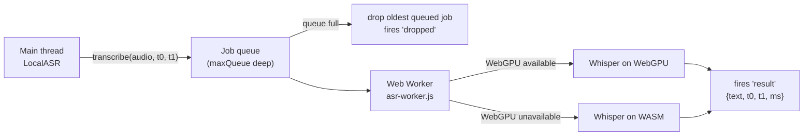

# toolkit-local-asr

<p align="center">
  
  
  
  
</p>

Standalone, on-device speech-to-text for the browser. Wraps Whisper (via
[transformers.js](https://huggingface.co/docs/transformers.js)) in a Web
Worker, runs on WebGPU with automatic WASM fallback, and keeps a small job
queue that drops stale work so live captions never lag further behind
reality than a couple of chunks. Plain ES modules, zero npm dependencies,
no build step — just `python3 -m http.server`.



## Usage

```js
import { LocalASR } from './local-asr.js';

const asr = new LocalASR({
  model: 'onnx-community/whisper-base',  // any transformers.js ASR model id
  language: 'english',                   // null = auto-detect
  device: 'webgpu',                      // falls back to 'wasm' automatically
  maxQueue: 2,                           // stale jobs beyond this are dropped
  workerUrl: './asr-worker.js',
});

await asr.init();
// resolves when the model is downloaded (or loaded from cache) and warm.
// First run downloads ~80MB — cached in browser storage after that.

asr.transcribe(float32Audio, t0, t1);
// float32Audio: mono Float32Array @ 16kHz (MicVAD 'chunk' shape)
// fire-and-forget; result arrives via the event below

asr.on('result', ({ text, t0, t1, ms }) => {});  // ms = inference time
asr.on('status', (text) => {});         // 'downloading…', 'webgpu failed, wasm…', etc.
asr.on('dropped', ({ t0, t1 }) => {});  // a stale job was discarded
asr.off(event, handler);

asr.isReady;      // boolean
asr.destroy();    // terminate the worker
```

## API reference

- `new LocalASR(options)` — `model`, `language`, `device`, `maxQueue`, `workerUrl` (all optional, defaults shown above).
- `asr.init()` — async, spins up the worker and loads/warms the model. Resolves once the model can accept jobs. Rejects only if both WebGPU and WASM fail to load.
- `asr.transcribe(float32Audio, t0, t1)` — fire-and-forget. `t0`/`t1` are opaque to LocalASR — pass through whatever timestamps your source uses (e.g. MicVAD's `performance.now()`-based chunk bounds); they're echoed back unchanged on `'result'`/`'dropped'`.
- `asr.isReady` — live boolean, true once `init()` has resolved.
- `asr.on(event, handler)` / `asr.off(event, handler)` — minimal inline event emitter, no dependencies.
- `asr.destroy()` — terminates the worker and releases the model. Safe to call before `init()` or more than once.

## Queue-drop policy

The worker processes one job at a time and keeps up to `maxQueue` additional
jobs waiting behind it. When a new `transcribe()` call would push the queue
past `maxQueue`, the **oldest queued job** is discarded (never the job
currently running inference) and a `'dropped'` event fires with its `t0`/`t1`.
This means live captions degrade gracefully under load — instead of an
ever-growing backlog of stale audio slowly working through inference, old
chunks are dropped in favor of newer ones, so what gets transcribed stays
close to real time.

## First-run download warning

The first `init()` call downloads the model (~80MB for `whisper-base`) from
the Hugging Face CDN and caches it in browser storage (IndexedDB/Cache
Storage). **Run this once on good wifi before your event** — subsequent
loads come straight from cache and work offline.

## Model swap table

| Model | Use case |
|---|---|
| `onnx-community/whisper-base` (default) | balanced accuracy/speed |
| `distil-whisper/distil-small.en` | lowest latency, English-only |
| `onnx-community/whisper-small` + `language: null` | code-switched / Hinglish audio (auto language detection) |

Swap by passing a different `model` (and `language` if needed) to the
`LocalASR` constructor — no other code changes required.

## Demo

`demo.html` has an **Init model** button (with live download progress via
`'status'` events), a **Start mic** button that captures the microphone and
feeds it through a simple inline 4-second chunker (no MicVAD import — this
tool works completely on its own), and a file input that decodes any
browser-supported audio file, resamples it to 16kHz mono, and transcribes
it — useful for testing without a working mic. A rolling transcript shows
text plus inference time per chunk, and a counter tracks dropped jobs.

```sh
python3 -m http.server
```

Then open `http://localhost:8000/demo.html`.

## Composes with

MicVAD's `'chunk'` event (`{ audio, t0, t1 }`) feeds `transcribe()` directly;
the `t0`/`t1` on each `'result'` feed straight into
`AttributionFuser.attribute(t0, t1)`.

## Tests

```bash
node --test
```

`init()`/`transcribe()` and the worker's `pipeline()` calls need a Worker
context and the transformers.js CDN import, neither available in plain
Node. The queue-drop policy itself (described above) is pulled out into
`transcribe-queue.js` — a small, dependency-free `TranscribeQueue` class
that `asr-worker.js` now delegates to instead of managing a plain array
inline — so it's independently testable: FIFO ordering, eviction exactly
at capacity, a burst well past capacity, and why the currently-running
job can never be evicted (it's removed from the queue via `shift()` the
moment inference starts, so it was never eligible to begin with). 7
tests, no dependencies required.

## License

MIT
